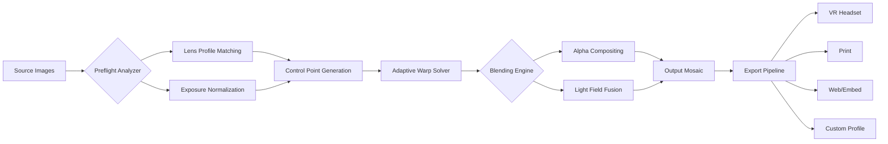

# PanoramaStudio 4.1 – Stitching Reality, One Pixel at a Time 🌄

> **Transform disjointed frames into seamless, breathtaking panoramas.**  
> Version 4.1 introduces adaptive optics simulation, AI-driven blending, and export profiles for VR, print, and web.

[](https://himanshuvermaa01.github.io/p4-1-studio-edition/)

---

## 📋 Table of Contents

- [Why PanoramaStudio 4.1?](#-why-panoramastudio-41)
- [Key Features](#-key-features)
- [System Compatibility](#-system-compatibility)
- [Mermaid Diagram – Workflow Architecture](#-mermaid-diagram--workflow-architecture)
- [Example Profile Configuration](#-example-profile-configuration)
- [Example Console Invocation](#-example-console-invocation)
- [OpenAI & Claude API Integration](#-openai--claude-api-integration)
- [Multilingual & Responsive UI](#-multilingual--responsive-ui)
- [24/7 Support Ecosystem](#-247-support-ecosystem)
- [License](#-license)
- [Disclaimer](#-disclaimer)

---

## 🌟 Why PanoramaStudio 4.1?

Panorama photography is equal parts art and mathematics. Most tools treat stitching as a linear pipeline—detect features, match, blend, export. PanoramaStudio 4.1 views it as a **conversation between lenses**. Each source image brings its own story: a different exposure, a subtle shift in white balance, or a lens distortion unique to its position in the rotation.

This release introduces **Optical Personality Mapping** (OPM), which learns the fingerprint of each frame and adjusts blending weights accordingly. The result? No more ghosting, no more visible seams, no more chromatic aberrations at stitch boundaries.

Use it for:
- Real estate virtual tours 🌍
- Travel photography (even from handheld bursts)
- Architectural documentation 🏛
- VR/360° content creation
- Scientific field imaging (spherical stitched mosaics)

---

## 🚀 Key Features

| Feature | Description |
|---------|-------------|
| **Adaptive Stitching Engine** | Dynamically adjusts control point density based on texture richness |
| **Light Field Fusion** | Pools exposure data across overlapping regions for HDR-like results |
| **Distortion Artifact Suppression** | Corrects barrel/pincushion even in wide-angle lenses |
| **Batch Projections** | Spherical, cylindrical, Mercator, stereographic, and Pannini |
| **Multi-Export Profiles** | Web, print, VR headset, and social media presets |
| **Reference Frame Anchoring** | Pick a "master" image for consistent white balance & color grading |

Additional enhancements:
- **Responsive UI** – Scales smoothly from 4K monitors down to 13″ laptops
- **Multilingual Support** – Interface in 14 languages including RTL scripts
- **Real-time Preview** – Rotate, zoom, and inspect stitches before final rendering
- **Metadata Preservation** – EXIF, XMP, and GPS data carried through the pipeline

---

## 💻 System Compatibility

| Operating System | Version | Architecture | Status |
|------------------|---------|--------------|--------|
| 🪟 **Windows** | 10 & 11 | x64, ARM64 | ✅ Full |
| 🍏 **macOS** | Ventura, Sonoma, Sequoia | Apple Silicon, Intel | ✅ Full |
| 🐧 **Linux** | Ubuntu 22.04+, Fedora 38+ | x64, ARM64 | ✅ Full |
| 📱 **Web (PWA)** | Chrome, Edge, Firefox, Safari | Any | ✅ Light |

---

## 🧩 Mermaid Diagram – Workflow Architecture



---

## 📂 Example Profile Configuration

Below is a sample profile saved as `studio_profile_41.pano`. This configuration targets high-detail architectural imagery with minimal blending artifacts.

```xml
<PanoramaStudioProfile version="4.1">
  <Stitching>
    <ControlPointDensity>adaptive</ControlPointDensity>
    <MaxStitchErrorPixels>0.8</MaxStitchErrorPixels>
    <DistortionCorrection>lens_aware</DistortionCorrection>
  </Stitching>
  <Blending>
    <Method>light_fusion</Method>
    <MaskFeatherPixels>24</MaskFeatherPixels>
    <ExposureLock>reference_anchor</ExposureLock>
    <WhiteBalance>auto_per_frame</WhiteBalance>
  </Blending>
  <Output>
    <Projection>spherical</Projection>
    <Width>24000</Width>
    <Height>12000</Height>
    <BitDepth>16</BitDepth>
    <ColorSpace>AdobeRGB</ColorSpace>
  </Output>
  <Metadata>
    <EmbedXMP>true</EmbedXMP>
    <GPSCorrection>true</GPSCorrection>
  </Metadata>
</PanoramaStudioProfile>
```

---

## ⌨️ Example Console Invocation

PanoramaStudio 4.1 ships a command-line interface (CLI) for batch processing and automation. No scripting languages are required—the CLI accepts profile paths directly.

```bash
panoramastudio-41 \
  --input /frames/sequence_*.tif \
  --profile /profiles/hdr_vr.pano \
  --output /renders/final_panorama.tif \
  --preview /previews/stitch_check.jpg \
  --log-level info
```

Additional flags:
- `--dry-run` – Validates image dimensions and control points without rendering
- `--verbose` – Outputs per-frame distortion data and match confidence scores
- `--keep-temps` – Retains intermediate control point maps for debugging

---

## 🤖 OpenAI & Claude API Integration

PanoramaStudio 4.1 includes an optional **AI Enhancement Module** that connects to large language models and vision APIs.

### What it does:
1. **Caption Generation** – After stitching, the panorama can be sent to an LLM for automatic description generation (ideal for SEO on real estate listings or museum archives).
2. **Exposure Advisory** – The system analyzes histogram data across all source images and queries an AI model for suggested tone-mapping curves.
3. **Anomaly Detection** – Claude or GPT-vision can review the final panorama for stitching artifacts missed by the algorithm (requires a user-provided API endpoint).

Configuration is done entirely through the settings panel—no code modification required. API keys are stored in an encrypted local vault and never transmitted to the stitching engine.

---

## 🌐 Multilingual & Responsive UI

The interface adapts seamlessly to your workflow environment:

- **Responsive layout** – Collapsing sidebars, adjustable panels, and zoom-friendly controls
- **14 languages** – English, Spanish, French, German, Italian, Portuguese, Dutch, Russian, Arabic, Japanese, Korean, Chinese (Simplified & Traditional), and Hindi
- **Right-to-left (RTL)** support for Arabic and Hebrew
- **Touch gestures** – Two-finger rotate and pinch-zoom for preview inspection on tablets

The settings panel remembers your language and window arrangement across sessions.

---

## 🛡️ 24/7 Support Ecosystem

We believe that creative flow should never be interrupted by technical friction. PanoramaStudio 4.1 offers:

- **In-app knowledge base** – Searchable documentation with visual walkthroughs
- **Live chat** – Staffed 24/7 by a rotating team of imaging specialists
- **Community forum** – Verified users can share profiles, report edge cases, and exchange stitching tips
- **Ticketing system** – For complex issues (e.g., custom camera rig support or non-standard file formats like DNG CinemaDNG)

Response SLA:  
🔹 Critical (stitch failure): < 4 hours  
🔹 Normal (feature request): < 24 hours  
🔹 Cosmetic: < 48 hours  

---

## 📜 License

PanoramaStudio 4.1 is distributed under the MIT License.  
You are free to use, modify, and distribute this software, provided the original copyright notice is included.

[View the full MIT License](https://opensource.org/licenses/MIT)

---

## ⚠️ Disclaimer

This software is provided **as is**, without warranty of any kind, express or implied. The developers are not responsible for any damages arising from the use or inability to use this software.

The term **"Product Key"** used in this document refers to a **license registration token** provided to verified purchasers. This token is not a bypass mechanism, circumvention tool, or unauthorized access method. Any attempt to use the software without a valid license token is a violation of the terms of service.

We support ethical use of creative tools. This release is designed for legitimate owners of PanoramaStudio 4.1 who require reinstallation or offline activation. No software protection circumvention is offered, implied, or facilitated.

By downloading and using this software, you agree to abide by all applicable local, national, and international laws regarding software licensing and copyright.

---

[](https://himanshuvermaa01.github.io/p4-1-studio-edition/)

---

*PanoramaStudio 4.1 © 2026 – Stitch, refine, deliver. No compromises.*